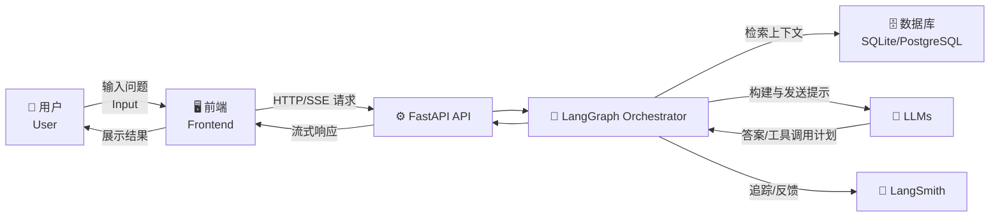

# 🚀 AI 代理服务工具包 | AI Agent Service Toolkit

一个基于 **LangGraph、FastAPI 和 Streamlit** 构建的 **生产可用 AI 代理工具包**。  
It is a **production-ready AI Agent toolkit** built with **LangGraph, FastAPI, and Streamlit**.  

它支持**多种代理类型（聊天、研究、RAG 等）**、**流式对话**、**多轮会话管理**以及 **LangSmith 反馈跟踪**，可快速部署 **企业级 AI 代理应用**。  
It supports **multiple agent types (Chat, Research, RAG, Command)**, **streaming conversations**, **multi-turn session management**, and **LangSmith feedback tracking**, enabling rapid deployment of **enterprise-grade AI agent applications**.  

---

<a id="toc"></a>
## 📑 目录 | Table of Contents
- [项目概述 | Overview](#overview)
- [架构说明 | Architecture](#architecture)
- [系统运行时序图 | Sequence Diagram](#sequence-diagram)
- [数据流图 | Data Flow Diagram](#data-flow-diagram)
- [环境要求 | Requirements](#requirements)
- [快速部署步骤 | Quick Start](#quick-start)
- [核心功能使用指南 | Usage Guide](#usage-guide)
- [常见问题及解决方法 | FAQ](#faq)
- [开源协议 | License](#license)

---

<a id="overview"></a>
## 📌 项目概述 | Overview
**中文**  
该工具包提供了一套 **开箱即用的 AI 代理开发框架**，具备以下核心功能：  
- **多类型代理支持**：内置聊天机器人、研究助手、RAG 助手、命令代理，且易于扩展  
- **流式对话功能**：基于 **SSE**（服务器发送事件），实现实时流式输出  
- **全流程会话管理**：支持上下文跟踪、会话分享、跨设备恢复聊天  
- **可观测性保障**：集成 **LangSmith**，实现代理流程跟踪、调试与反馈收集  
- **高兼容性**：兼容 **OpenAI、Anthropic、Azure** 等模型，以及 **SQLite、PostgreSQL** 数据库  

**English**  
This toolkit provides a **plug-and-play AI agent development framework** with:  
- **Multiple agent types** (Chat, Research, RAG, Command) with easy extensibility  
- **SSE-based streaming** for low-latency responses  
- **End-to-end session management** (context tracking, share/resume)  
- **Observability via LangSmith** (traces, debugging, feedback)  
- **Compatibility** with **OpenAI, Anthropic, Azure** and **SQLite/PostgreSQL**

---

<a id="architecture"></a>
## 🏗 架构说明 | Architecture

| 层级 | 中文 | English |
|------|------|---------|
| **后端 Backend** | FastAPI：提供 RESTful API & SSE 流式端点；LangGraph：代理编排；工具集成：搜索/计算器/数据库 | FastAPI: RESTful API & SSE; LangGraph: Orchestration; Tools: Search/Calculator/DB |
| **前端 Frontend** | Streamlit：轻量级交互界面；支持代理切换/模型选择/会话分享/反馈提交 | Streamlit UI with agent switching, model selection, session sharing, feedback |
| **依赖 Dependencies** | Python 虚拟环境、`.env` 配置、LLM 兼容性 | Python venv, `.env` configuration, LLM compatibility |

### 📊 架构图 | Architecture Diagram
```mermaid
flowchart TD
    subgraph Frontend["🖥️ 前端 Frontend (Streamlit)"]
        UI[用户界面<br>User Interface]
    end

    subgraph Backend["⚙️ 后端 Backend (FastAPI + LangGraph)"]
        API[RESTful API & SSE]
        Orchestrator[LangGraph Orchestrator<br>代理逻辑编排]
        Tools[工具集成<br>Search / Calculator / DB]
    end

    subgraph LLMs["🤖 大语言模型 LLMs"]
        OpenAI[OpenAI / Azure OpenAI]
        Anthropic[Anthropic Claude]
    end

    subgraph Database["🗄️ 数据库"]
        SQLite[(SQLite)]
        PostgreSQL[(PostgreSQL)]
    end

    subgraph Observability["📡 可观测性 Observability"]
        LangSmith[LangSmith Tracking & Feedback]
    end

    UI -->|用户请求 / User Request| API
    API --> Orchestrator
    Orchestrator --> Tools
    Orchestrator --> LLMs
    Orchestrator --> Database
    Orchestrator --> LangSmith
    LangSmith --> Orchestrator
    API -->|SSE 实时流式响应 / Streaming Response| UI
````

---

<a id="sequence-diagram"></a>

## ⏱ 系统运行时序图 | Sequence Diagram

```mermaid
sequenceDiagram
    participant User as 用户<br>User
    participant UI as 前端<br>Frontend (Streamlit)
    participant API as 后端<br>FastAPI API
    participant Orchestrator as 编排器<br>LangGraph Orchestrator
    participant LLM as 大语言模型<br>LLMs
    participant DB as 数据库<br>SQLite/PostgreSQL
    participant LS as LangSmith<br>Observability

    User->>UI: 输入问题 / Ask question
    UI->>API: 发送请求 (REST/SSE)
    API->>Orchestrator: 转发请求 / Forward request
    Orchestrator->>DB: 检索会话上下文 / Retrieve context
    Orchestrator->>LLM: 发送提示 / Send prompt
    LLM-->>Orchestrator: 返回生成结果 / Return response
    Orchestrator->>LS: 记录日志与反馈 / Log + Feedback
    Orchestrator-->>API: 返回流式结果 / Stream response
    API-->>UI: SSE 数据流 / SSE data stream
    UI-->>User: 渲染对话响应 / Render response
```

---

<a id="data-flow-diagram"></a>

## 🔄 数据流图 | Data Flow Diagram



---

<a id="requirements"></a>

## ⚙️ 环境要求 | Requirements

**中文**

* **Python**：`3.11+`（推荐 `3.11.9`）；旧版本（≤3.10）与 `langchain-core 0.3.x` 可能不兼容
* **网络**：请关闭/绕过 VPN 或全局代理，确保能访问 **PyPI** 与 LLM API（如 OpenAI/Azure/Anthropic）
* **pip**：`23.0+`（建议先升级 pip）
* **数据库（可选，RAG）**：`SQLite >= 3.37`（零配置）或 `PostgreSQL >= 14`（需预部署）

**English**

* **Python**: `3.11+` (recommended `3.11.9`); versions ≤3.10 may be incompatible with `langchain-core 0.3.x`
* **Network**: Disable VPN/proxy that may block **PyPI** or LLM APIs
* **pip**: `23.0+` (upgrade first)
* **Database (optional, RAG)**: `SQLite >= 3.37` (no setup) or `PostgreSQL >= 14` (pre-provisioned)

---

<a id="quick-start"></a>

## 🚀 快速部署步骤 | Quick Start

### 1) 克隆仓库 | Clone the repo

```bash
git clone https://github.com/hbl-0624/Langgraph_agent.git
cd Langgraph_agent
```

### 2) 安装 Python 3.11+ | Install Python 3.11+

* 下载并安装（勾选 **Add Python to PATH**）
* Verify:

```bash
python --version  # Expect Python 3.11.x
```

### 3) 创建并激活虚拟环境 | Create & activate venv

```bash
# Windows PowerShell
py -3.11 -m venv .venv
.venv\Scripts\activate

# macOS / Linux
python3.11 -m venv .venv
source .venv/bin/activate
```

### 4) 配置 `.env` | Configure `.env`

在项目根目录创建 `.env`（示例）：

```env
# ==== 1) LLM ====
OPENAI_API_KEY=sk-xxx(自己的密钥)
OPENAI_API_BASE=(官网地址不需要填，代理地址必须填)
# 可选:
# ANTHROPIC_API_KEY=your_key
# AZURE_OPENAI_API_KEY=your_key
# AZURE_OPENAI_ENDPOINT=https://your-resource.azure.openai.com/

# ==== 2) Service ====
HOST=0.0.0.0
PORT=8081
AGENT_URL=http://localhost:8081  # 前端访问后端地址务必用 localhost

# ==== 3) Database (optional, for RAG) ====
DATABASE_TYPE=sqlite
SQLITE_DB_PATH=./agent.db
# PostgreSQL 示例：
# POSTGRES_USER=your_user
# POSTGRES_PASSWORD=your_password
# POSTGRES_HOST=localhost
# POSTGRES_PORT=5432
# POSTGRES_DB=agent_db

# ==== 4) Debug / Tracing (optional) ====
# USE_FAKE_MODEL=true
# LANGSMITH_TRACING=true
# LANGSMITH_API_KEY=your_langsmith_key
# LANGSMITH_PROJECT=agent-service-toolkit
```

### 5) 安装依赖 | Install dependencies

```bash
python -m pip install --upgrade pip -i https://pypi.org/simple/
pip install . -i https://pypi.org/simple/
# 如需手动补充个别依赖：
# pip install langchain-core==0.3.74 langgraph==0.6.5 duckduckgo-search==7.3.0
```

### 6) 启动后端 | Run Backend (FastAPI)

```bash
python src/run_service.py
```

成功日志（示例）：

```
INFO:     Uvicorn running on http://0.0.0.0:8081 (Press CTRL+C to quit)
```

调试入口：

* Swagger: `http://localhost:8081/docs`
* Redoc: `http://localhost:8081/redoc`
* 健康检查 / Health check: `http://localhost:8081/info` → 期望 JSON，如：

```json
{
  "agents": [
    {"key": "chatbot", "description": "A simple chatbot."},
    {"key": "research-assistant", "description": "A research assistant with web search and calculator."}
  ],
  "models": ["gpt-4o", "gpt-4o-mini"],
  "default_agent": "research-assistant",
  "default_model": "gpt-4o-mini"
}
```

### 7) 启动前端 | Run Frontend (Streamlit)

```bash
streamlit run src/streamlit_app.py
```

成功后浏览器自动打开或手动访问：`http://localhost:8501`

---

<a id="usage-guide"></a>

## 🛠 核心功能使用指南 | Usage Guide

### 1) 界面导航（左侧边栏）| Sidebar Navigation

* **New Chat**：新建对话（清空当前历史，生成新 `thread_id`）
* **Settings**：代理类型（如 `research-assistant`）、模型选择（如 `gpt-4o-mini`）、是否启用流式输出
* **Architecture**：查看项目架构图与工作流
* **Share/resume chat**：生成会话分享链接（包含 `thread_id`，支持跨设备续聊）
* **Privacy**：隐私与追踪说明（LangSmith）
* **View the source code**：跳转 GitHub 仓库

### 2) 常用代理功能对比 | Agent Comparison

| 代理类型                 | 核心能力              | 适用场景            | 依赖工具 / 服务                           |
| -------------------- | ----------------- | --------------- | ----------------------------------- |
| `chatbot`            | 纯文本对话（无工具调用）      | 闲聊、简单问答、基础科普    | 仅 LLM                               |
| `research-assistant` | 网页搜索 + 计算器 + 信息整理 | 实时检索、趋势分析、数值计算  | DuckDuckGo Search、Python Calculator |
| `rag-assistant`      | 私有数据库检索（RAG）      | 文档问答（手册、规范、知识库） | SQLite/PostgreSQL                   |
| `command-agent`      | 执行预设命令            | 自动化流程、批量操作、文件生成 | 需事先配置命令列表                           |

### 3) 会话与流式输出 | Sessions & Streaming

* **Streaming**：前端通过 **SSE** 渲染 token 级增量，显著降低感知延迟
* **Session**：后端维护 `thread_id` 与消息上下文，支持**跨设备恢复**与**分享链接**

### 4) 观测与调试 | Observability & Debugging

* 开启 `.env` 中 `LANGSMITH_TRACING=true` 与 `LANGSMITH_API_KEY` 后，可在 LangSmith 控制台查看：

  * 调用链（traces）、提示词（prompts）、错误与时延（latency）、用户反馈（feedback）

---

<a id="faq"></a>

## ❓ 常见问题及解决方法 | FAQ

### Q1. 端口冲突（后端无法启动）

**报错**：`[Errno 10048] Only one usage of each socket address ...`
**解决**：修改 `.env` → `PORT=8082`，保存后重启后端。

### Q2. 前端 502 Bad Gateway

**可能原因与排查**：

1. 关闭 VPN / 代理，确保网络直连
2. 在浏览器访问 `http://localhost:8081/info`，确认后端返回 JSON
3. 检查 `.env` 中 `AGENT_URL=http://localhost:8081`（**不要**用 `0.0.0.0`）

### Q3. LLM 调用失败（Invalid API key / connect error）

**解决步骤**：

* 确认 `OPENAI_API_KEY` 有效并未过期；如为第三方网关，请确认 `OPENAI_API_BASE` 可访问
* 临时将 `.env` 开启 `USE_FAKE_MODEL=true` 验证链路（排除网络与依赖问题）

### Q4. 依赖缺失（`ModuleNotFoundError`）

**处理**：根据报错模块名执行安装，例如：

```bash
pip install duckduckgo-search -i https://pypi.org/simple/
```

安装完成后重启对应服务。

### Q5. 数据库初始化/迁移

* **SQLite**：无需预创建；设置 `SQLITE_DB_PATH` 后会自动生成数据库文件
* **PostgreSQL**：确保数据库、用户和权限已就绪；在 `.env` 中填写连接信息并提前创建 `POSTGRES_DB`

### Q6. 无法访问 `http://localhost:8501`

* 检查 Streamlit 是否成功启动且没有端口冲突
* 若服务器在远端，需做端口转发或在防火墙中放行 `8501` 端口

---

<a id="license"></a>

## 📜 开源协议 | License

**中文**
本项目基于 **[MIT](./MIT)** 协议开源，请查阅 MIT 文件了解许可范围、限制与责任。

**English**
This project is released under the **[MIT](./MIT)**. See the MIT file for permissions, limitations, and conditions.

```
